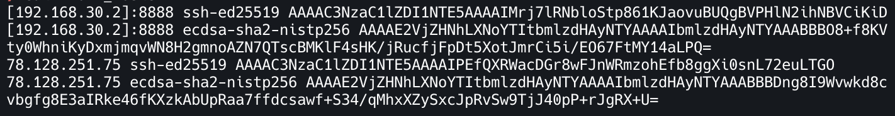
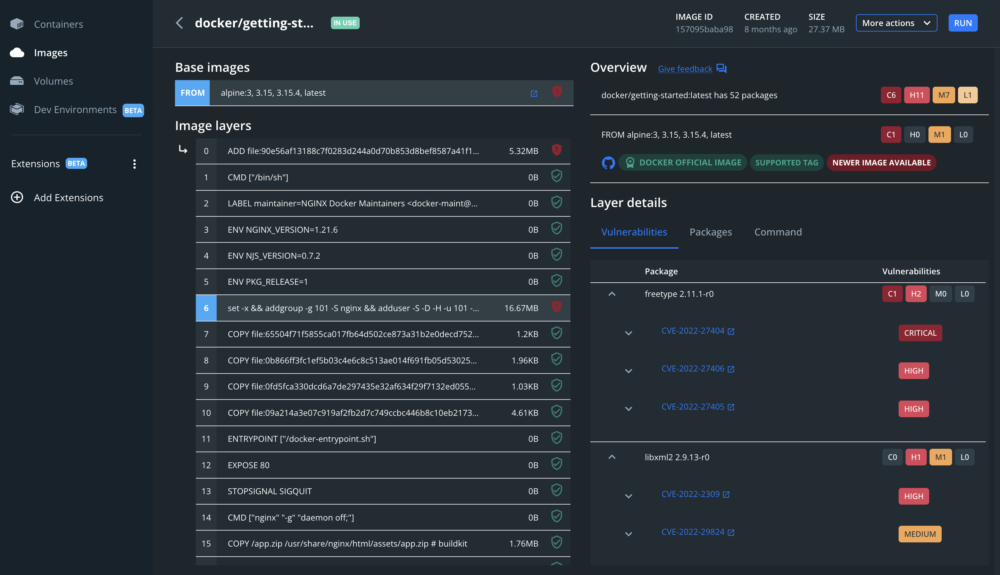
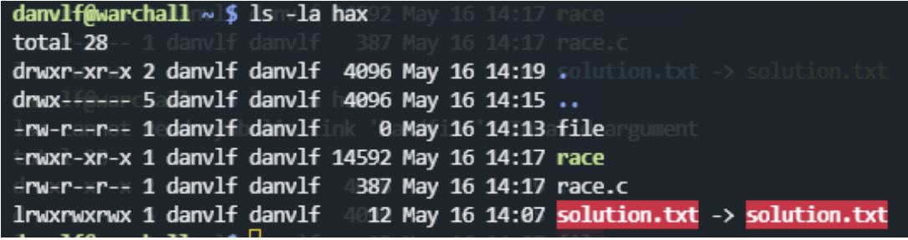
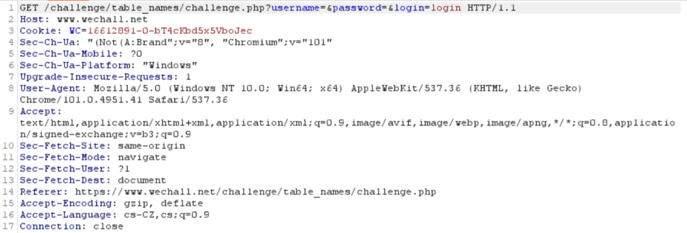
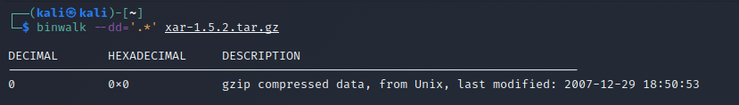
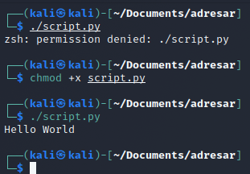
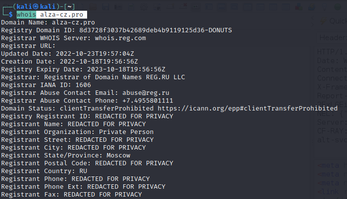

# Test - verze A 

1. Na snímku je vidět výpis specifického souboru. Co výpis znamená?




``` 
a) Seznam klíčů hostitelů (serverů), který slouží k neověřenému připojení
b) Jeden dlouhý klíč, který nás připojí na komplexní síť na několika vrstvách oprávnění
c) Seznam klíču hostitelů (serverů), který slouží k ověřenému připojení
d) Seznam uložených šifrovaných hesel k veřejným bezdrátovým sítím
```

2. Analyzujte snímek, odpovězte ve správném pořadí.



    1. 
    A) Analýza našla celkem 6 kritických zranitelností
    B) Analýza našla celkem 5 kritických zranitelností
    
    2.
    A) Zranitelnosti byly nalezeny na 2 vrstvách
    B) Zranitelnosti byly nalezeny na 1 vrstvě
    
    3. Zranitelnost CVE-2021-27404 je kritická zranitelnost
    A) LEŽ
    B) PRAVDA

```
a) BAB
b) ABA
c) ABB
d) BBA
```

3. V terminláu je vypsán veškerý obsah složky **hax**. Na soubor **soulution.txt** byla použita operace. Dokažete určit jaká?




```
a) Strings
b) Symlink
c) File
d) Whois

```

4. Co vidíme na snímku?



```
a) POST login request
b) GET register request
c) GET login request
d) POST resgister request
```

5. K čemu slouží použitý nástroj na snímku?




```
a) Nástroj extrahuje všechny známé souborové typy
b) Nástroj extrahuje jen specifický typ souboru
c) Nástroj neextrahuje nic, protože vybraný filtr extrahovaných souboru je špatně určený
d) Nástroj extrahuje soubor, jen pokud název obsahuje "*"
```
6. Jakou akci pozorujeme na snímku?


```
a) Soubor "script.py" má opravnění ke spuštění, ty jsou mu odebrána a "script.py" nejde následně spustit
b) Soubor "script.py" nemá opravnění ke spuštění, ty jsou mu přidána a     "script.py" nejde následně spustit
c) Soubor "script.py" má opravnění ke spuštění, ale uživatel ne
d) Soubor "script.py" nemá opravnění ke spuštění, ty jsou mu přidána a "script.py" jde následně spustit
```

7. Na snímku vidíme informace o nedávno vytvořeném podvodném webu **alza-cz.pro**. Dokážete vyčíst informace o podvodné doméně? 





```
a) Doména je registrována s CZ doménou, takže její původ je z ČR
b) Většina údajů je z důvodu soukromí skryta, takže nejde získat informace o původu hostingu
c) Doména je registrována přes Ruský Registrátor, tudíž je doména původem z Ruska 
```

